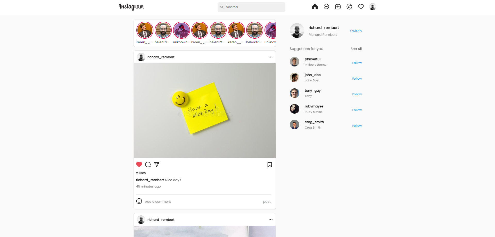

Instagram Clone (MERN Stack)
This is an Instagram clone built using the MERN stack (MongoDB, Express, React, Node.js).

Live Demo 🚀

Prerequisites
Ensure you have the following installed on your development machine:

Git - Download & Install Git.
Note: OSX and Linux machines typically come with Git pre-installed.

Node.js - Download & Install Node.js (includes npm).
If you encounter any issues, you can use this GitHub Gist for alternative installation steps.

Cloning the Repository
To clone this repository, use the following Git command:

bash
Copy
Edit
git clone https://github.com/nisabmohd/Instagram-mern.git
Environment Variables
React Setup (Frontend)
Create a .env file inside the frontend/src directory and add the following variables:

env
Copy
Edit
REACT_APP_API_URL=http://localhost:8000
REACT_APP_GOOGLE_OAUTH_REDIRECT_URL=http://localhost:8000/auth/google/oauth
REACT_APP_GOOGLE_CLIENT_ID={google auth client id}
Node Setup (Backend)
Create a .env file inside the backend directory and add the following variables:

env
Copy
Edit
PORT={port number}
Mongo_URI={your mongo uri}
JWT_Secret={jwt secret}
JWT_Refresh_Secret={jwt refresh secret}
CLIENT_URL=http://localhost:3000
email=userzyx01@xyz.com
password=1skjsnksdsd
clientid={google auth client id}
clientsecret={google auth client secret}
redirect_url=http://localhost:8000/auth/google/oauth
Running the Application
To start the application, follow these steps:

Start the Backend (Server)
Open a terminal and navigate to the backend directory.
Run the following commands:
bash
Copy
Edit
$ cd backend
$ node server.js
Start the Frontend (Client)
Open a terminal and navigate to the frontend directory.
Run the following commands:
bash
Copy
Edit
$ cd frontend
$ npm start
The client application will run on http://localhost:3000.
The server application will run on http://localhost:8000.
Screenshots
Login Page

Home Page

Stories

Chat

Explore

Profile

Deployment
Frontend Live Link: Frontend App
